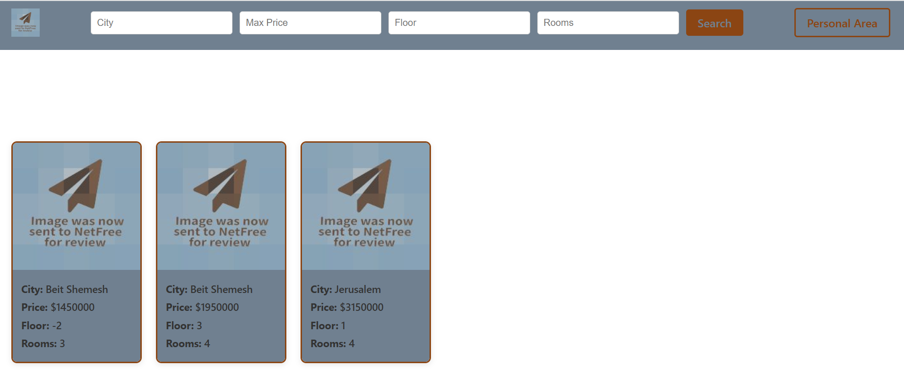
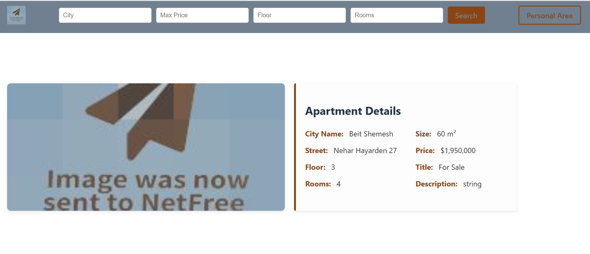
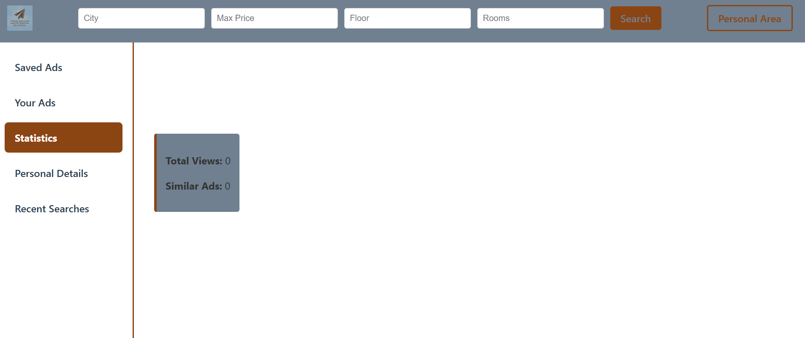

<p align="center">
  
</p>

<h1 align="center">🏙️ Appartment Search</h1>

<p align="center">
  A modern web application for searching apartments for sale.<br/>
  Includes a personal area with saved ads, published listings, personal details, and recent searches.<br/>
</p>

---

## About The Project

**Appartment Search** is a full-stack real estate search platform that helps users find apartments for sale easily and efficiently.  
It provides a personal dashboard to manage saved listings, posted ads, and personal data in a clean and intuitive interface.

### Features
- 🏡 Apartment search by keywords and filters (city, price, rooms, etc.)  
- ⭐ Save favorite listings for later  
- 📢 Post and manage personal ads  
- 👤 Personal area with user details and statistics  
- 📊 View recent searches and activity summary  
- 🧩 Full-stack architecture with clean separation between client and server  

---

## 🧩 Built With

- **Frontend:** ⚛️ React (Vite)
- **Backend:** 🧱 .NET 8 Web API (C#) + Entity Framework Core  
- **Database:** 🗄️ SQL Server  

---

## 🖼️ Screenshots

| Home Page | Apartment Details | Personal Area |
|------------|------------------|----------------|
|  |  |  |
<a href="https://github.com/YochevedRot/appartment-search/tree/main/images">More Screenshots</a>

---

## 🚀 Getting Started

#### 1️⃣ Clone the repository
```bash
git clone https://github.com/yourusername/appartment-search.git
cd appartment-search
```
#### 2️⃣ Install client dependencies and run
```bash
cd AppartmentSearch-Client
npm install
npm run dev
```
#### 3️⃣ Setup and run the server
```bash
cd ../AppartmentSearch-Server
dotnet restore
dotnet build
```
#### 4️⃣ Configure the database
If migrations already exist:
```bash
dotnet ef database update
```
If not:
```bash
dotnet ef migrations add InitialCreate
dotnet ef database update
```
Make sure your appsettings.json includes a valid connection string:
```bash
{
  "ConnectionStrings": {
    "DefaultConnection": "Server=(localdb)\\\\mssqllocaldb;Database=AppartmentSearchDb;Trusted_Connection=True;MultipleActiveResultSets=true"
  }
}
```
#### 5️⃣ Run the server
```bash
dotnet run
```

---

#### 🧭 Usage

🌐 Open [http://localhost:5173](http://localhost:5173)  
🔐 Sign up or log in to your account  
🏙️ Search apartments by city, price range, and filters  
⭐ Save or 📢 publish listings  
👤 Access your personal dashboard to manage data and view stats  


---

#### 🔒 License

This project is private and may not be copied, modified, or redistributed without explicit permission from the author.

<p align="center"> Made with ❤️ by <a href="https://github.com/YochevedRot">Yocheved Rot</a> </p> 
